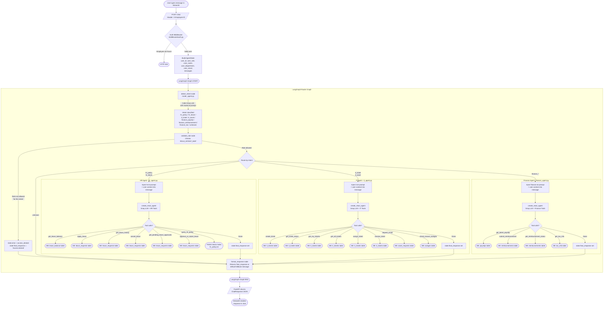

# Enterprise Multi-Agent AI Copilot — Agent Flow

This document describes the complete request lifecycle from the moment a user types a message to the moment a response is returned.

---

## 1. High-Level Architecture

```
┌─────────────────────────────────────────────────────────────┐
│                      User (Browser)                         │
│                  Streamlit  :8501                            │
└────────────────────────────┬────────────────────────────────┘
                             │  HTTP POST /chat
                             │  Header: X-Employee-ID
                             ▼
┌─────────────────────────────────────────────────────────────┐
│                  FastAPI Backend  :8000                      │
│                                                             │
│   Auth Middleware → /chat endpoint → run_graph()            │
└────────────────────────────┬────────────────────────────────┘
                             │
                             ▼
┌─────────────────────────────────────────────────────────────┐
│              LangGraph Router Graph                         │
│                                                             │
│  detect_intent ──► validate_role ──► [domain agent]        │
│                                           │                 │
│                                     format_response         │
└─────────────────────────────────────────────────────────────┘
```

---

## 2. Step-by-Step Request Flow



---

## 3. Context Injection Pattern (All Domain Agents)

Each domain agent prepends a **context block** to the user's first message before passing it to the ReAct agent. This eliminates the need for SystemMessage (which causes issues on some LLM providers):

```
Instructions: <contents of agents/prompts/{agent}.txt>
User ID: 3, Name: Alice Johnson, Role: employee, Dept: Engineering.
IMPORTANT: Whenever a tool requires 'user_id', you MUST use the exact integer 3.

<original user message>
```

---

## 4. Prompt Files (agents/prompts/)

| File | Used by | Purpose |
|------|---------|---------|
| `hr.txt` | `hr_agent.py` | HR assistant persona and responsibilities |
| `it.txt` | `it_agent.py` | IT support assistant persona and responsibilities |
| `finance.txt` | `finance_agent.py` | Finance assistant persona and responsibilities |
| `router.txt` | `router_agent.py` | Intent classification instructions with `{intent_labels}` and `{user_message}` placeholders |

> **To update any agent's behaviour, edit only the `.txt` file. No Python changes needed.**

---

## 5. Role-Based Access Control (RBAC)

The `validate_role` node enforces which intents each role can access:

| Role | Allowed Intents |
|------|----------------|
| `employee` | hr_policy, hr_leave, it_ticket, it_asset, finance_payslip, finance_reimbursement, finance_tax |
| `manager` | All employee intents |
| `hr_team` | hr_policy, hr_leave, it_ticket, finance_payslip, finance_reimbursement |
| `it_team` | it_ticket, it_asset, hr_policy |
| `finance_team` | finance_payslip, finance_reimbursement, finance_tax, hr_policy |
| `admin` | All intents |

---

## 6. RAG (Retrieval-Augmented Generation) Flow

Used only when `query_hr_policy` tool is called by the HR agent:

```
User question
     │
     ▼
HuggingFace Embeddings (all-MiniLM-L6-v2)
     │
     ▼
FAISS similarity_search (faiss_index/)
     │
     ▼
RBAC filter — only chunks the user's role can access
     │
     ▼
Department filter — only HR chunks (when called from hr_agent)
     │
     ▼
Top-k chunks returned as formatted context string
     │
     ▼
Included in LLM tool response → final answer with source citations
```

Source documents ingested into FAISS (`docs/`):

| File | Department | Accessible to |
|------|-----------|--------------|
| `hr_policy.txt` | HR | employee, manager, hr_team, admin |
| `it_sop.txt` | IT | employee, manager, it_team, admin |
| `finance_rules.txt` | Finance | employee, manager, finance_team, admin |

---

## 7. Approval Flow

When an agent action requires approval (e.g. leave > 3 days, asset request):

```
Agent sets requires_approval = True
        │
        ▼
ApprovalManager.create_pending_approval()
(in-memory registry: agents/approval_agent.py)
        │
        ▼
Frontend shows "Approval Required" warning banner
        │
        ▼
Manager logs in → Pending Approvals page → Approve / Reject
        │
        ▼
POST /approve/{id} → approval_manager.process_approval()
        │
        ├── Updates DB (leave / asset / reimbursement status)
        └── Sends email notification via Power Automate (if configured)
```

---

## 8. File Structure Reference

```
enterprise-copilot/
├── api/
│   └── main.py              ← FastAPI app, all HTTP endpoints
├── agents/
│   ├── router_agent.py      ← LangGraph graph: detect_intent → validate_role → route
│   ├── hr_agent.py          ← HR ReAct agent
│   ├── it_agent.py          ← IT ReAct agent
│   ├── finance_agent.py     ← Finance ReAct agent
│   ├── approval_agent.py    ← In-memory approval registry
│   ├── state.py             ← AgentState TypedDict (shared graph state)
│   └── prompts/
│       ├── __init__.py      ← Loads .txt files, exports constants
│       ├── hr.txt           ← HR agent system prompt (edit freely)
│       ├── it.txt           ← IT agent system prompt (edit freely)
│       ├── finance.txt      ← Finance agent system prompt (edit freely)
│       └── router.txt       ← Intent classification prompt (edit freely)
├── tools/
│   ├── hr_tools.py          ← LangChain tools: leave management
│   ├── it_tools.py          ← LangChain tools: ticket & asset management
│   ├── finance_tools.py     ← LangChain tools: payslip, reimbursement, tax
│   └── email_tools.py       ← Power Automate email notifications
├── rag/
│   ├── ingest.py            ← Load docs → chunk → embed → save FAISS index
│   └── retriever.py         ← RBAC-aware FAISS similarity search
├── db/
│   ├── models.py            ← SQLAlchemy ORM models
│   ├── crud.py              ← All DB read/write operations
│   └── database.py          ← SQLite engine + session factory
├── middleware/
│   └── auth.py              ← X-Employee-ID header auth + require_role() RBAC
├── frontend/
│   └── app.py               ← Streamlit UI
└── docs/
    ├── agent_flow.md        ← This file
    ├── hr_policy.txt        ← RAG source document
    ├── it_sop.txt           ← RAG source document
    └── finance_rules.txt    ← RAG source document
```
